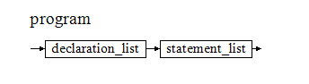

# Simply-SW-programming-language-compiler
## 1 介绍
本文档主要介绍了SW语言的语法定义及编译器设计相关信息。 
本编译器对Sw (扩展后的)语言能够完成词法分析、语法分析、简单的出错处理、代码生成和解释程序。 
实现了的扩展点有：跳过行注释和块注释，支持求余、判断奇偶、自增自减运算符，支持switch/case 、continue、exit、break、repeat语句，支持bool数据类型及其and、or、not的布尔数据运算，支持实数数据类型及其加减乘除四则运算，且支持实数与整数数据类型的转换操作符，支持常量的定义与使用，支持定义整数、实数、布尔类型的数组及其赋值、表达式中被使用、输出操作，支持带参数的函数进行数值传递、支持带返回值的函数过程。
## 2 编译器系统结构
### 2.1 编译器
#### 2.1.1 Sw语言（含扩展）定义及其语法图

（语法定义中红色部分为扩展部分）
program = declaration_list statement_list.

图1 program语法图

declaration_list = var_declaration_list function_declaration_list.
 
图2 declaration_list语法图

var_declaration_list = { var_declaration ";" }.
 
图3 var_declaration_list语法图

var_declaration = ("var" ident [ "[" number "]" ] ) | ("bool" ident [ "[" number "]" ] ) | ("const" ident "=" expression) | ("float" ident [ "[" number "]" ] ) .
 
图4 var_declaration语法图

function_declaration_list = { "func" ident "(" [ ( ("var" ident) | ("bool" ident) | ("float" ident) ) { "," ( ("var" ident) | ("bool" ident) |  ("float" ident) ) } ] ")" "{" function_body "}" }.
 
图5 function_declaration_list语法图

function_body = var_declaration_list statement_list [ "return" expression ";" ].
 
图6 function_body语法图

statement_list = {statement ";"}.
 
图7 statement_list语法图

statement = if_stat | while_stat | read_stat | print_stat | assign_stat | for_stat | call_stat | switch_stat | repeat_stat | ident_plus | "exit" | "continue" | "break" .
 
图8 statement语法图

if_stat = "if" condition "{" statement_list "}" ["else" "{" statement_list "}"].
 
图9 if_stat语法图

while_stat = "while" condition "{" [ statement_list ] "}".
 
图10 while_stat语法图

read_stat = "read" "(" ident ")".
 
图11 read_stat语法图

print_stat = "print" "(" ident [ "[" number "]" ] ")".
 
图12 print_stat语法图

assign_stat = ident [ "[" number "]" ] (( "=" (expression | call_stat ) ) | ( ( "++" | "--") )).
 
图13 assign_stat语法图

for_stat = "for" ident "in" (ident|number) "..." (ident|number) "{" statement_list "}".
 
图14 for_stat语法图

call_stat = "call" ident "(" [ expression { "," expression } ] ")".
 
图15 call_stat语法图

condition = expression ("=="|"!="|"<"|"<="|">"|">=") expression | "odd" expression.
 
图16 condition_stat语法图

expression = ["+"|"-"|"not"] term { ("+"|"-") term}.
 
图17 expression语法图

term = factor { ("*"|"/"|"%"|"and"|"or") factor}.
 
图18 term语法图

factor =( ident [ "[" number "]" ] [ "++" | "--"] ) | ( ("toint" | "tofloat") "(" ident ")" ) | "true" | "false" | number | "(" expression ")".
 
图19 factor语法图

switch_stat = "switch" expression "{" {"case" number ":" statement_list "break" ";" } "default" ":" statement_list "break" ";" "}".
 
图20 switch_stat语法图

repeat_stat = "repeat" "{" [statement_list ] "}" "while" condition.
 
图21 repeat_stat语法图

ident_plus =  ( "toint" | "tofloat") "(" ident ")" .
 
图22 ident_plus语法图

#### 2.1.2 判断是否符合两条限制规则
两条限制规则（引用自教材）为：
限制规则1在语法图上可以这样表述：图中每个分支点，分支的选择惟一由下一个读入符号确定。换句话说，不允许有两个分支都以相同的符号开始
限制规则2可以这样表述：一种图形结构如果无需读入一个符号就可以贯通，我们称这种图形结构是“透明”的。对于一个透明的图形结构，必须能惟一确定下一个读入符号属于该图形或者属于该图形的跟随符号。换句话说，透明结构的始端符号集合与可能的所有跟随符号集合必须成相异关系
验证一组语法图是否符合两条限制规则的具体做法是：
①找出图中每一个分支点，考察每个分支点的各个分支的头符号是否相异
②找出图中每一个透明结构，考察每个透明结构的头符号集合与其跟随符号集合是否相异
通常称满足两条语法限制规则的一组语法图为确定的图系统。
通过检查，符合上述两条限制规则。
#### 2.1.3 过程调用相关图
参照教材图8-1程序过程调用相关图，做出所示下图。

图23  Sw语言过程语法分析调用相关图

图24  Sw语言过程所有函数调用相关图
#### 2.1.4 程序总体结构
``` c
void error(int n); 
void getsym();
void getch();
void init();

void program(int tx, bool* fsys, int lev);
void var_declaration_list(int* ptx, int* pdx, int lev);
void statement_list(int* ptx, bool* fsys, int lev);
void expression(int* ptx, bool* fsys, int lev);
void condition(int* ptx, bool* fsys, int lev);
void term(int* ptx, bool* fsys, int lev);
void factor(int* ptx, bool* fsys, int lev);

int position(char* idt, int tx);
void enter(enum object k, int* ptx, int* pdx, int lev);

void gen(enum fct x, int y, float z);
void test(bool* s1, bool* s2, int n);
int inset(int e, bool* s);
int addset(bool* sr, bool* s1, bool* s2, int n);
int subset(bool* sr, bool* s1, bool* s2, int n);
int mulset(bool* sr, bool* s1, bool* s2, int n);
void interpret();
void listcode(int cx0);
void listall();
int base(int l, float* s, int b);

``` 
#### 2.1.5 语法出错表定义
表1  出错编号对应语法错误信息

### 2.2 虚拟机
#### 2.2.1 虚拟机组织结构
它仅由2个存储器、1个指令寄存器和3个地址寄存器组成。程序存储器code用来存放通过编译产生的中间代码程序（目标程序），它在程序解释执行过程中保持不变。数据存储器s被当成数据栈（sack）使用。所有的算术和关系操作符都从栈顶找到它的操作数，又以计算结果取而代之。栈顶数据单元的地址用地址寄存器t（top）标记。数据存储器s只有在代码程序被解释执行时才开始使用。指令寄存器i含有正在解释的指令。程序地址寄存器p含有下一条要从程序存储器取得的、被解释执行指令的地址。
如下图所示：
 
图 25 虚拟机组织结构图
#### 2.2.2 虚拟机指令格式
``` c
/* 虚拟机代码结构 */
struct instruction
{
    enum fct f;             /* 虚拟机代码指令 */
    int l;                  /* 引用层与声明层的层次差 */
    float a;                /* 根据f的不同而不同 */
};
```
#### 2.2.3 虚拟机指令系统及其解释
``` c
/* 虚拟机代码指令 */
enum fct {
    lit,     /* lit 0, a 将数a置入栈顶 */
    opr,     /* opr 0, a 一组算术关系运算符 返回调用程序 */
    lod,     /* lod 1, a 将1,a形成的栈地址变量值置入栈顶 */
    sto,     /* sto 1, a 将栈顶值存到由1,a形成的栈地址变量 */
    cal,     /* cal 1, a 调用子程序 */    
    ini,     /* int 0, a 预留a个存储位置 (int写作ini避免与C语言中的INT混淆) */
    jmp,     /* jmp 0, a 无条件转移 */
    jpc,     /* jpc 0, a 条件转移 (当s(t)==0时) */
};
```
## 3 模块架构
如下图所示：
 
图 26 模块架构图

## 4 模块功能介绍
### 4.1 词法分析
主要由getsym函数完成。调用getch过滤空格，行注释与块注释，读取一个字符，每次读一行，存入line缓冲区，line被getsym取空后再读一行，通过分析获取的符号来判断是保留字，标识符，符号，数字还是其他。

### 4.2 语法分析
判断所识别的符号是否符合语法规则，如不符合则生成错误标号。

### 4.3 中间代码生成
根据语法分析的结果生成相应可解释执行的虚拟机代码。

### 4.4 解释执行
通过读取虚拟机代码，执行堆栈的操作模拟程序的实际运行来输出相应结果。

### 4.5 出错处理
读取错误标号，用相应数目的空格输出来表示错误出现的位置。

### 4.6 表格管理
根据定义的变量是实数，整数，布尔类型及其数组，常量，抑或函数过程来记录其存储地址，相应地址等相关信息（诸如函数需要的空间大小，常量的数值多少）

## 5．模块接口
### 5.1 词法分析
直接调用getsym()函数即可，无需其他参数，符号保存在变量sym中。

### 5.2 语法分析
初始状态时, tx=0, lev=0, fsys包含程序所有可能的开始符号集合。
``` c
/* 
 * 编译程序主体
 *
 * tx:     符号表当前尾指针 
 * fsys:   当前模块后继符号集合
 * lev:    当前分程序所在层
 */
void program(int tx, bool* fsys, int lev)
```
### 5.3 中间代码生成
根据所要执行的操作参照指令系统输入相应的f表明操作类型，及l多表示层数, a多用于传参。
``` c
/* 
 * 生成虚拟机代码
 *
 * x: instruction.f; 
 * y: instruction.l; 
 * z: instruction.a;
 */
void gen(enum fct x, int y, float z)
{
    if (cx >= cxmax)
    {
        printf("Program is too long!X(\n");       /* 生成的虚拟机代码程序过长 */
        exit(1);
    }
    if ( z >= amax)
    {
        printf("Displacement address is too big!8(\n");/* 地址偏移越界 */
        exit(1);
    }
    code[cx].f = x;
    code[cx].l = y;
    code[cx].a = z;
    cx++;
}
```
### 5.4 解释执行
对已经转为中间代码的code存储器，调用interpret()进行解释执行。
```c 
/* 解释程序 */
void interpret()
{
    int p = 0;                      /* 指令指针 */
    int b = 1;                      /* 指令基址 */
    int t = 0;                      /* 栈顶指针 */
    struct instruction i;           /* 存放当前指令 */
    float fs[stacksize];            /* 小数栈 */

    printf("Start SW\n");
    fprintf(fresult,"Start SW\n");
    fs[0] = 0;                       /* s[0]不用 */
    fs[1] = 0;                       /* 主程序的三个联系单元均置为0 */
    fs[2] = 0;
    fs[3] = 0;
    do {
        i = code[p];                /* 读当前指令 */
        p = p + 1;
        switch (i.f)
        {
            case lit:               /* 将常量a的值取到栈顶 */
                t = t + 1;
                fs[t] = i.a;             
                break;
            case opr:               /* 数学、逻辑运算 */
                switch ((int)i.a)
                {
                    case 0:       /* 函数调用结束后返回 */
                        t = b - 1;
                        p = (int)fs[t + 3];
                        b = (int)fs[t + 2];
                        break;
                    case 1:       /* 栈顶元素取反 */
                        fs[t] = - fs[t];
                        break;
                    case 2:       /* 次栈顶项加上栈顶项，退两个栈元素，相加值进栈 */
                        t = t - 1;
                        fs[t] = fs[t] + fs[t + 1];
                        break;
                    case 3:       /* 次栈顶项减去栈顶项 */
                        t = t - 1;
                        fs[t] = fs[t] - fs[t + 1];
                        break;
                    case 4:       /* 次栈顶项乘以栈顶项 */
                        t = t - 1;
                        fs[t] = fs[t] * fs[t + 1];
                        break;
                    case 5:       /* 次栈顶项除以栈顶项 */
                        t = t - 1;
                        fs[t] = (int)fs[t] / (int)fs[t + 1];
                        break;
                    case 6:       /* 栈顶元素的奇偶判断 */
                        fs[t] = (int)fs[t] % 2;
                        break;
                    case 7:       /* 次栈顶项取余栈顶项 */
                        t = t - 1;
                        fs[t] = (int)fs[t] % (int)fs[t + 1];
                        break;
                    case 8:       /* 次栈顶项与栈顶项是否相等 */
                        t = t - 1;
                        fs[t] = (fs[t] == fs[t + 1]);
                        break;
                    case 9:       /* 次栈顶项与栈顶项是否不等 */
                        t = t - 1;
                        fs[t] = (fs[t] != fs[t + 1]);
                        break;
                    case 10:      /* 次栈顶项是否小于栈顶项 */
                        t = t - 1;
                        fs[t] = (fs[t] < fs[t + 1]);
                        break;
                    case 11:      /* 次栈顶项是否大于等于栈顶项 */
                        t = t - 1;
                        fs[t] = (fs[t] >= fs[t + 1]);
                        break;
                    case 12:      /* 次栈顶项是否大于栈顶项 */
                        t = t - 1;
                        fs[t] = (fs[t] > fs[t + 1]);
                        break;
                    case 13:      /* 次栈顶项是否小于等于栈顶项 */
                        t = t - 1;
                        fs[t] = (fs[t] <= fs[t + 1]);
                        break;
                    case 14:      /* 栈顶值输出 */
                        printf("%d", (int)fs[t]);
                        fprintf(fresult, "%d", (int)fs[t]);
                        t = t - 1;
                        break;
                    case 15:      /* 输出换行符 */
                        printf("\n");
                        fprintf(fresult,"\n");
                        break;
                    case 16:      /* 读入一个输入置于栈顶 */
                        t = t + 1;
                        printf("?");
                        fprintf(fresult, "?");
                        int tmp;
                        scanf("%d", &tmp);
                        fs[t] = tmp;
                        fprintf(fresult, "%d\n", tmp);                     
                        break;
                    case 17:
                        t = t - 1;
                        break;
                    case 18:      /* 次栈顶项与栈顶项是否相等 */
                        fs[t] = (fs[t] == fs[t - 1]);
                        break;
                    case 19:
                        fs[t] = fs[t] + fs[t - 1];
                        if(fs[t]>=1)
                            fs[t] = 1;
                        else
                            fs[t] = 0;
                        break;
                    case 20:
                        fs[t] = (int)fs[t];
                        break;
                    case 21:
                        fs[t] = (float)fs[t];
                        break;
                    case 22:      /* 栈顶值输出 */
                        printf("%f", fs[t]);
                        fprintf(fresult, "%f", fs[t]);
                        t = t - 1;
                        break;
                    case 23:      /* 栈顶值输出 */
                        if(fs[t] == 1)
                        {
                            printf("true");
                            fprintf(fresult, "true");
                        }
                        else if(fs[t] == 0)
                        {
                            printf("false");
                            fprintf(fresult, "false");
                        }
                        else
                        {
                            error(31);
                        }
                        t = t - 1;
                        break;
                    case 24:      /* 读入一个输入置于栈顶 */
                        t = t + 1;
                        printf("?");
                        fprintf(fresult, "?");
                        scanf("%f", &fs[t]);
                        fprintf(fresult, "%f\n", fs[t]);
                        break;
                    case 25:      /* 读入一个输入置于栈顶 */
                        t = t + 1;
                        printf("?");
                        fprintf(fresult, "?");
                        char inputtmp[6];
                        scanf("%s", inputtmp);
                        if (strcmp(inputtmp,"true") == 0)
                        {
                            fs[t] = 1;
                            fprintf(fresult, "%s\n", "true");
                        }
                        else if(strcmp(inputtmp, "false") == 0)
                        {
                            fs[t] = 0;
                            fprintf(fresult, "%s\n", "false");
                        }
                        break;
                    case 26:
                        if(fs[t] == 0)
                        {
                            fs[t] = 1;
                        }
                        else
                        {
                            fs[t] = 0;
                        }
                        break;
                    case 27:         /* 次栈顶项除以栈顶项 */
                        t = t - 1;
                        fs[t] = fs[t] / fs[t + 1];
                        break;
                    case 28:
                        {
                            int ti;
                            for(ti = 0;ti<(int)i.l;ti++)
                            {
                                fs[t+3+(int)i.l] = fs[t];
                                t--;
                            }
                        }
                        break;
                    case 29:
                        t-=3+(int)i.l;
                        break;
                    case 30:
                        {
                            int ti;
                            for(ti = 0;ti<3+(int)i.l;ti++)
                            {
                                t++;
                                fs[t] = fs[t+(int)i.l];
                            }
                        }
                        break;
                    case 31:
                        t++;
                        fs[t] = fs[t+(int)i.l];
                        break;
                }
                break;
            case lod:           /* 取相对当前过程的数据基地址为a的内存的值到栈顶 */
                t = t + 1;
                fs[t] = fs[base(i.l, fs, b) + (int)i.a];              
                break;
            case sto:           /* 栈顶的值存到相对当前过程的数据基地址为a的内存 */
                fs[base(i.l, fs, b) + (int)i.a] = fs[t];
                t = t - 1;
                break;
            case cal:           /* 调用子过程 */
                fs[t + 1] = base(i.l, fs, b); /* 将父过程基地址入栈即建立静态链 */
                fs[t + 2] = b;  /* 将本过程基地址入栈，即建立动态链 */
                fs[t + 3] = p;  /* 将当前指令指针入栈，即保存返回地址 */
                b = t + 1;      /* 改变基地址指针值为新过程的基地址 */
                p = (int)i.a;   /* 跳转 */
                break;
            case ini:           /* 在数据栈中为被调用的过程开辟a个单元的数据区 */
                t = t + (int)i.a;    
                break;
            case jmp:           /* 直接跳转 */
                p = (int)i.a;
                break;
            case jpc:           /* 条件跳转 */
                if (fs[t] == 0) 
                    p = (int)i.a;
                t = t - 1;
                break;
        }
    } while (p != 0);
    printf("End sw\n");
    fprintf(fresult,"End sw\n");
}
```
### 5.5 出错处理
在出错的地方调用此函数过程，并传入错误标号。
``` c
/* 出错处理，打印出错位置和错误编码 */  
void error(int n)
{
    char space[81];
    memset(space,32,81);    /* 32为asii码表的空格 初始化字符串为全空格*/
    space[cc-1]=0;          /* 出错时当前符号已经读完，所以cc-1 */

    printf("**%s^%d\n", space, n);
    fprintf(foutput,"**%s^%d\n", space, n);

    err = err + 1;
    if (err > maxerr)
    {
        printf("There are too many errors to handle!:(\n");
        exit(1);
    }
}
```
### 5.6 表格管理
在表格中加入信息时，传递标识符种类，符号表尾指针，当前分配的变量相对地址及其所在层次，传递给过程enter()。
``` c
/* 
 * 在符号表中加入一项 
 *
 * k:      标识符的种类
 * ptx:    符号表尾指针的指针，为了可以改变符号表尾指针的值
 * pdx:    dx为当前应分配的变量的相对地址，分配后要增加1
 * lev:    标识符所在的层次
 */
void enter(enum object k, int* ptx, int* pdx, int lev)

6．全局数据结构、常量和变量

#define bool int            /* 因为C语言没有bool类型 */
#define true 1              /* 所以做这3行处理 */
#define false 0

#define norw 29             /* 保留字个数 10+19 */
#define txmax 100           /* 符号表容量 */
#define nmax 14             /* 数字的最大位数 */
#define al 10               /* 标识符的最大长度 10?*/

#define maxerr 30           /* 允许的最多错误数 */
#define amax 2048           /* 地址上界*/
#define cxmax 200           /* 最多的虚拟机代码数 */
#define stacksize 500       /* 运行时数据栈元素最多为500个 */
#define levmax 1            /* 最大允许过程嵌套声明层数*/


/* 符号 */
enum symbol {
    nul,                    /* 未定义 */
    ident,                  /* 标识符 */
    number,                 /*  数字  */
    plus,   minus,          /*  +  -  */
    times,  slash,          /*  *  /  */
    eql,                    /*   ==   */
    neq,                    /*   !=   */
    lss,    leq,            /*  <  <= */
    gtr,    geq,            /*  >  >= */
    lparen, rparen,         /*  (  )  */
    lbrace, rbrace,         /*  {  }  */
    semicolon,              /*   ;    */
    threepoints,            /*  ...   */
    becomes,                /*   =    */
    plusone,    minusone,   /* ++, -- */
    mod,                    /*   %    */
    colon,                  /*   :    */
    comma,                  /*   ,    */
    lbrack, rbrack,         /*  [  ]  */
    ifsym,     elsesym,   whilesym,   forsym,    insym,
    readsym,   printsym,  callsym,    varsym,    funcsym,
    boolsym,   constsym,  floatsym,   oddsym,    switchsym,
    casesym,   breaksym,  repeatsym,  notsym,    defaultsym,
    andsym,    orsym,     exitsym,    tointsym,  tofloatsym,
    truesym,   falsesym,  returnsym,  eofsym,    continuesym,
};
#define symnum 57           // 27+29+1


/* 符号表中的类型 */
enum object {
    variable,               /*  变量  */
    function,               /*  函数  */
    boolean,                /*  布尔  */
    constant,               /*  常数  */
    floatnum,               /*  实数  */
};


/* 虚拟机代码指令 */
enum fct {
    lit,                    /* lit 0, a 将数a置入栈顶 */
    opr,                    /* opr 0, a 一组算术关系运算符 返回调用程序 */
    lod,                    /* lod 1, a 将1,a形成的栈地址变量值置入栈顶 */
    sto,                    /* sto 1, a 将栈顶值存到由1,a形成的栈地址变量 */
    cal,                    /* cal 1, a 调用子程序 */    
    ini,                    /* int 0, a 预留a个存储位置 (int写作ini避免与C语言中的INT混淆) */
    jmp,                    /* jmp 0, a 无条件转移 */
    jpc,                    /* jpc 0, a 条件转移 (当s(t)==0时) */
};
#define fctnum 8


/* 虚拟机代码结构 */
struct instruction
{
    enum fct f;             /* 虚拟机代码指令 */
    int l;                  /* 引用层与声明层的层次差 */
    float a;                /* 根据f的不同而不同 */
};

struct parameter
{
    char name[al];
    enum object type;
};

struct parameter p[10];     /* 函数内可传递最多10个参数 */

/* 全局变量 (中间过程使用) */
bool listswitch ;           /* 显示虚拟机代码与否 */
bool tableswitch ;          /* 显示符号表与否 */
struct instruction code[cxmax]; /* 存放虚拟机代码的数组 */
char mnemonic[fctnum][5];   /* 虚拟机代码指令名称 */
bool declbegsys[symnum];    /* 表示声明开始的符号集合 */
bool statbegsys[symnum];    /* 表示语句开始的符号集合 */
bool facbegsys[symnum];     /* 表示因子开始的符号集合 */

char ch;                    /* 存放当前读取的字符，getch 使用 */
enum symbol sym;            /* 当前的符号 */
char id[al+1];              /* 当前ident，多出的一个字节用于存放0 */
float num;                  /* 当前number */
int cc, ll;                 /* getch使用的计数器，cc表示当前字符(ch)的位置 */
int cx;                     /* 虚拟机代码指针, 取值范围[0, cxmax-1]*/
char line[81];              /* 读取行缓冲区 */
char a[al+1];               /* 临时字符串，多出的一个字节用于存放0 */
char word[norw][al];        /* 保留字 */
enum symbol wsym[norw];     /* 保留字对应的符号值 */
enum symbol ssym[256];      /* 单字符的符号值 */

bool isend = false;         /* 文件是否读完 */
bool isjmp[10];             /* statement_list语句中可否有continue和break语句 */
bool isfor = false;         /* 当前执行语句是否在for-in语句中(循环体内除外)内 */
bool isfloat = false;       /* 标识符所存数据类型是否是小数 */
int circlenum = 0;          /* 当前位于几个循环体内 */
int continue_cx[10][100];   /* continue语句位置 */
int continue_n[10];         /* continue语句个数 */
int break_cx[10][100];      /* break语句位置 */
int break_n[10];            /* break语句个数 */
int exit_cx[100];           /* exit语句位置(最多100处) */
int exit_n = 0;             /* exit语句个数 */
int parameter_n = 0;        /* 函数()内参数个数 */
bool is_return = false;     /* 函数是否有返回值 */

/* 符号表结构 */
struct tablestruct
{
    char name[al];          /* 名字 */
    enum object kind;       /* 类型 */
    int val;                /* 数值，仅const使用 */
    int level;              /* 所处层, 仅const不使用 */
    int adr;                /* (开始)地址, 仅const不使用 */
    int size;               /* 需要分配的数据区空间, 仅function, array使用 */
    int para_n;             /* 函数参数个数, 仅function使用 */
    bool isreturn;          /* 是否有返回值, 仅function使用 */
};
struct tablestruct table[txmax]; /* 符号表 */


/* 全局变量 (输入输出相关) */
FILE* fin;                  /* 输入源文件 */
FILE* foutput;              /* 输出文件及出错示意（如有错）、各行对应的生成代码首地址（如无错） */
FILE* ftable;               /* 输出符号表 */
FILE* fcode;                /* 输出虚拟机代码 */
FILE* fresult;              /* 输出执行结果 */
char fname[al];             /* 输入字符串 (文件名, 是否选择) */
int err;                    /* 错误计数器 */

char current[10];           /* 当前所在函数名 */
int varmax = 0;             /* 全局变量的最大位置 */
```
## 7 函数原型
| 函数原型 | `void init()` |
| --- | --- |
| 参数描述 | 无 |
| 函数描述 | 初始化 |
| 返回值 | 无 |


| 函数原型 |`int inset(int e, bool* s)` |
| --- | --- |
| 参数描述 | 字符编号 e, 字符编号集合数组s |
| 函数描述 | 是否在集合中的真假运算 |
| 返回值 | 在则非0，不在则0 |


| 函数原型 |`int addset(bool* sr, bool* s1, bool* s2, int n)`|
| --- | --- |
| 参数描述 | 字符编号集合后的数组sr, 两个字符编号集合数组s1, s2, 集合元素数 |
| 函数描述 | 并运算 s1Us2 |
| 返回值 | 无 |


| 函数原型 |`int subset(bool* sr, bool* s1, bool* s2, int n)` |
| --- | --- |
| 参数描述 | 字符编号集合后的数组sr, 两个字符编号集合数组s1, s2, 集合元素数 |
| 函数描述 | 差运算 s1-s2 |
| 返回值 | 无 |


| 函数原型 | `int mulset(bool* sr, bool* s1, bool* s2, int n)` |
| --- | --- |
| 参数描述 | 字符编号集合数组sr, 两个字符编号集合数组s1, s2, 集合元素数 |
| 函数描述 | 交运算 s1ns2 |
| 返回值 | 无 |


| 函数原型 | `void error(int n)` |
| --- | --- |
| 参数描述 | 出错编号 |
| 函数描述 | 出错处理，打印出错位置和错误编码 |
| 返回值 | 无 |


| 函数原型 | `void getch()`|
| --- | --- |
| 参数描述 | 无 |
| 函数描述 | 过滤空格和两种表示方法的注释，读取一个字符，每次读一行，存入line缓冲区，line被getsym取空后再读一行，被函数getsym调用 |
| 返回值 | 无 |


| 函数原型 | `void getsym()` |
| --- | --- |
| 参数描述 | 无 |
| 函数描述 | 词法分析，获取一个符号 |
| 返回值 | 无 |


| 函数原型 |`void gen(enum fct x, int y, float z)`|
| --- | --- |
| 参数描述 | x: instruction.f;  y: instruction.l;  z: instruction.a; |
| 函数描述 | 生成虚拟机代码 |
| 返回值 | 无 |


| 函数原型 | `void test(bool* s1, bool* s2, int n)`|
| --- | --- |
| 参数描述 | s1:  需要的单词集合s2:  如果不是需要的单词，在某一出错状态时， 可恢复语法分析继续正常工作的补充单词符号集合 n:   错误编号 |
| 函数描述 | 测试当前符号是否合法在语法分析程序的入口和出口处调用测试函数test， 检查当前单词进入和退出该语法单位的合法性 |
| 返回值 | 无 |


| 函数原型 | `void program(int tx, bool* fsys, int lev)` |
| --- | --- |
| 参数描述 | tx:     符号表当前尾指针  fsys:   当前模块后继符号集合 lev:    当前分程序所在层 |
| 函数描述 | 编译程序主体 |
| 返回值 | 无 |


| 函数原型 | `void enter(enum object k, int* ptx, int* pdx, int lev)` |
| --- | --- |
| 参数描述 | k:      标识符的种类ptx:    符号表尾指针的指针，为了可以改变符号表尾指针的值pdx:    dx为当前应分配的变量的相对地址，分配后要增加1lev:    标识符所在的层次 |
| 函数描述 | 在符号表中加入一项 |
| 返回值 | 无 |


| 函数原型 | `int position(char* id, int tx)`|
| --- | --- |
| 参数描述 | id:    要查找的名字tx:    当前符号表尾指针 |
| 函数描述 | 查找标识符在符号表中的位置，从tx开始倒序查找标识符找到则返回在符号表中的位置，否则返回0 |
| 返回值 | 无 |


| 函数原型 |`void listcode(int cx0)`|
| --- | --- |
| 参数描述 | cx0: 虚拟机代码指针 |
| 函数描述 | 输出目标代码清单 |
| 返回值 | 无 |


| 函数原型 | `void listall()` |
| --- | --- |
| 参数描述 | 无 |
| 函数描述 | 输出所有目标代码并写入fcode文件 |
| 返回值 | 无 |


| 函数原型 | `void statement_list(int* ptx, bool* fsys, int lev)` |
| --- | --- |
| 参数描述 | ptx:     符号表当前尾指针fsys:   当前模块后继符号集合lev:    当前分程序所在层 |
| 函数描述 | 语句处理 |
| 返回值 | 无 |


| 函数原型 | `void expression(int* ptx, bool* fsys, int lev)` |
| --- | --- |
| 参数描述 | ptx:     符号表当前尾指针fsys:   当前模块后继符号集合lev:    当前分程序所在层 |
| 函数描述 | 表达式处理 |
| 返回值 | 无 |


| 函数原型 | `void term(int* ptx, bool* fsys, int lev)`|
| --- | --- |
| 参数描述 | ptx:     符号表当前尾指针fsys:   当前模块后继符号集合lev:    当前分程序所在层 |
| 函数描述 | 项处理 |
| 返回值 | 无 |


| 函数原型 | `void factor(int* ptx, bool* fsys, int lev)` |
| --- | --- |
| 参数描述 | ptx:     符号表当前尾指针fsys:   当前模块后继符号集合lev:    当前分程序所在层 |
| 函数描述 | 因子处理 |
| 返回值 | 无 |


| 函数原型 | `void condition(int* ptx, bool* fsys, int lev)` |
| --- | --- |
| 参数描述 | ptx:     符号表当前尾指针fsys:   当前模块后继符号集合lev:    当前分程序所在层 |
| 函数描述 | 条件处理 |
| 返回值 | 无 |


| 函数原型 | `void interpret()`|
| --- | --- |
| 参数描述 | 无 |
| 函数描述 | 解释程序 |
| 返回值 | 无 |


| 函数原型 | `int base(int l, float* s, int b)`|
| --- | --- |
| 参数描述 | l: 上移的层数s: 当前运行的栈b:指令基址 |
| 函数描述 | 通过过程基址求上l层过程的基址 |
| 返回值 | 无 |
